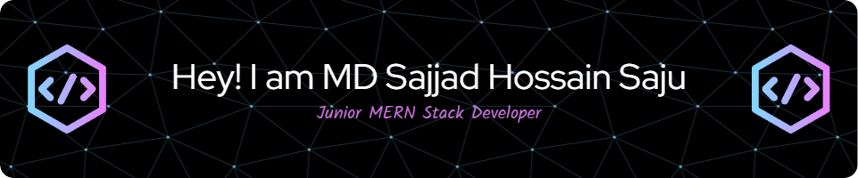

<!-- Banner Image -->

<!-- Name and Designation -->
# MD Sajjad Hossain Saju  
### Junior MERN Stack Developer  

---

## About Me

Hi! I'm learning to build full-stack websites using the MERN stack. I’ve already worked with HTML, CSS, JavaScript, React, React Router, and MongoDB. 
I enjoy turning ideas into real web applications. Right now, I’m focusing on improving my frontend and backend skills by building projects, practicing daily, and exploring new tools step by step. 
My goal is to become a confident full stack developer and work on real-world projects that help people and solve everyday problems.

### ⚡ My Current Activities

- 🌿 Recently worked on a [Plant Care Tracker](https://planttick.web.app) – a web app to manage plant care tasks
- 🌍 Built an [International Tutor Finder](https://fluently-web.firebaseapp.com) platform for top languages, allowing users to find and book tutors globally
- 🏗️ Currently learning to work with bigger, industry-scale full stack project structures
- 🔐 Exploring advanced authentication and role-based access control 
- 📚 Improving problem-solving and clean code practices
- 🚚 Currently developing a Parcel Delivery Web App featuring user, rider, and admin dashboards

---
## 🚀 Skills

### 🌐 Frontend Development

  
  
  
  
  
  
  

### 🔥 Backend & Database

  
  
  

### 🔐 Authentication & Security

  

### ☁️ Hosting & Deployment

  
  
  

### 🧰 Build Tools & Utilities

  

---

## 📬 Contact  

📧 **Email:** sajjadhossainsajux@gmail.com  
📱 **Phone:** +8801820646469  
📍 **Location:** Dhaka, Bangladesh  

---
 

---

## 🌐 Socials

## 📊 GitHub Stats:
 
 

---

<!-- Proudly created with GPRM ( https://gprm.itsvg.in ) -->

